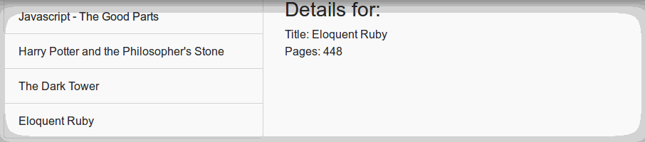

# Book list React Demo

This is a simple demo showcasing a master-detail layout using [React](https://reactjs.org/) and [Redux](https://github.com/reactjs/redux) and [create-react-app](https://github.com/facebook/create-react-app)

## How to run

- `git clone https://github.com/pedropb/react-book-list`
- `cd react-book-list`
- `npm install`
- `npm start`
- browse to [http://localhost:3000](http://localhost:3000)
